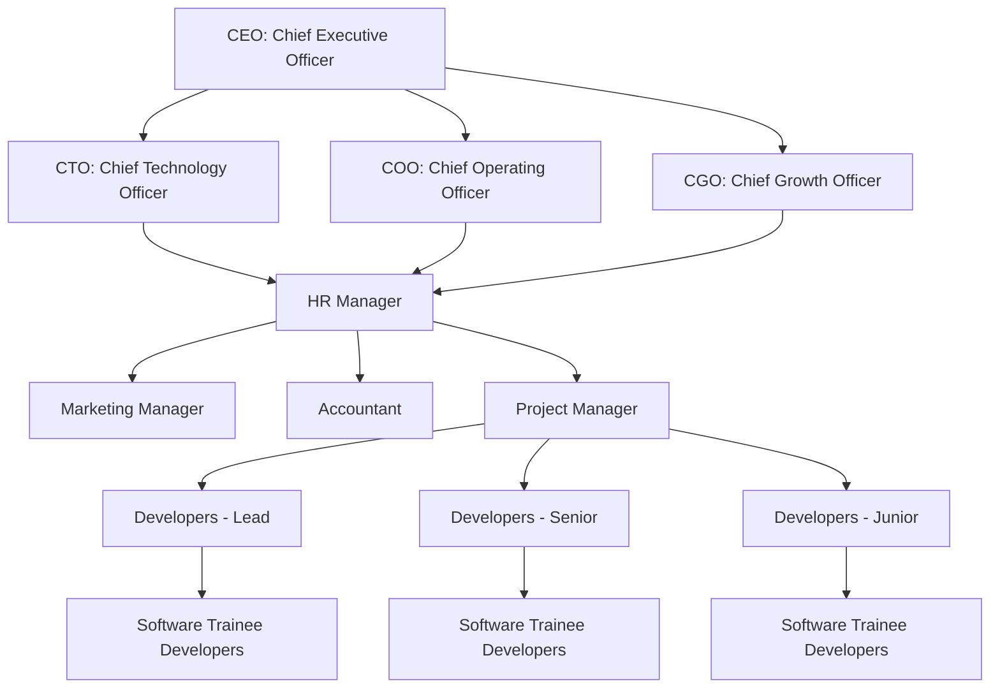

# Internship Report on BookNest — Full-Stack Online Bookstore

---

## 📄 TITLE PAGE

**MAHARASHTRA STATE BOARD OF TECHNICAL EDUCATION, MUMBAI**

**J.C.E.I’s JAIHIND POLYTECHNIC, KURAN**
*TAL-JUNNAR, DIST-PUNE 410511*

*(Academic Year: 2025 – 2026)*

---

### 📝 AN INTERNSHIP REPORT
**On**
### "BOOKNEST — FULL-STACK ONLINE BOOKSTORE"

**Submitted By:**
**OMPRASAD JAGDALE**
*Enrollment No: 23211390461*

**Under the Guidance of:**
**Mrs. LANDE R. S.**

**DEPARTMENT OF INFORMATION TECHNOLOGY**

---

## 📜 CERTIFICATE OF COMPLETION

**MAHARASHTRA STATE BOARD OF TECHNICAL EDUCATION**

**Certificate of Completion of Industrial Training**
*(By respective Head of the Department & Head of the Institute)*

This is to certify that **Mr. Omprasad Jagdale** with Enrollment No. **23211390461** has successfully completed Industrial Training (315004) in **"Globeminds Technology"** from **02-06-2025 to 23-08-2025** for partial fulfillment towards completion of Diploma in **Information Technology** from **J.C.E.I’S JAIHIND POLYTECHNIC, KURAN** *(Institute Code: 0508)*.

*Signature:* _________________________  
**Head of the Department**  

*Signature:* _________________________  
**Head of the Institute (with Seal)**  

---

## 🔍 I. ABSTRACT

I have attended a 12-week Industrial Training Program designed to bridge the gap between academic learning and industry requirements. The training emphasized hands-on experience with trending technologies and tools currently reshaping the IT landscape.

During this internship, I was exposed to a blend of theoretical concepts and practical sessions in high-demand areas such as Web Development (HTML5, CSS3, Vanilla JavaScript), Full-Stack Development using Node.js & Express.js, and Database Management using MongoDB & Mongoose ODM. These sessions provided a strong foundation in both front-end and back-end technologies essential for building modern web applications.

The program included real-time project development, industry-oriented assignments, and collaborative teamwork to simulate a real workplace environment. It aimed to enhance technical skills, problem-solving abilities, and overall employability by fostering a deeper understanding of software development life cycles (SDLC), agile methodologies, version control systems like Git, and professional communication.

By the end of the training, I had not only gained industry-relevant technical knowledge but also developed the confidence to face real-world IT challenges, making me job-ready and capable of contributing effectively in future full-stack software development roles.

---

## 🤝 II. ACKNOWLEDGEMENT

I wish to express my sincere gratitude to **Mr. Sudhir Madhukar Gorhade, Founder** of Globeminds Technology, for providing me with an opportunity to perform my 12 weeks of Industrial Training in **"Globeminds Technology"**

I sincerely thank **Mrs. Kajal Gurav, Industrial Supervisor**, for her constant guidance and encouragement in carrying out this Industrial Training. I also wish to express my gratitude to the officials and other staff members of **"Globeminds Technology"** who rendered their help during the period of my Industrial Training.

I am also thankful to **Dr. S. R. Pokharkar, Principal** of JCEI's Jaihind Polytechnic, Kuran, for providing me the opportunity to embark on this Industrial Training.

And I also thank **Mr. R. R. Tannu, Head of Department (Information Technology)**, **Mrs. R. S. Lande, Industrial Training Co-ordinator**, **Mrs. R. S. Lande, Mentor**, and all supporting staff members from our Institute for their invaluable encouragement and facilitation.

---

## 📋 III. TABLE OF CONTENTS

| Chapter | Title | Page No |
| :--- | :--- | :---: |
| | **Abstract** | I |
| | **Acknowledgement** | II |
| | **Contents** | III |
| **1** | **Organization Structure of Industry and General Layout** | 1 |
| **2** | **Introduction of Industry** | 3 |
| **3** | **Details of Equipment and Tools** | 6 |
| **4** | **Engineering/Development Process** | 8 |
| **5** | **Testing Tools and Methods** | 10 |
| **6** | **Safety Procedures Followed and Safety Gears Used by Industry** | 12 |
| **7** | **Particulars of Practical Experiences in Industry** | 14 |
| **8** | **Detailed Report on Task Undertaken (BookNest Bookstore)** | 15 |
| **9** | **Special/Challenging Experiences** | 45 |
| **10** | **Conclusion** | 46 |
| **11** | **References** | 47 |

---

## 🏢 CHAPTER 1: ORGANIZATION STRUCTURE OF INDUSTRY AND GENERAL LAYOUT

### 1.1 Organizational Chart



### 1.2 Role Definitions

| Role | Core Responsibilities |
| :--- | :--- |
| **CEO** | Provides leadership, defines the company vision, and makes strategic decisions for growth and direction. |
| **CTO** | Leads technology strategy, infrastructure, and innovation. Ensures use of modern, scalable tech solutions. |
| **COO** | Oversees day-to-day operations, delivery schedules, and process efficiency. Manages internal workflows. |
| **HR Manager** | Manages talent acquisition, recruitment policies, employee engagement, compliance, and training programs. |
| **Marketing Manager** | Drives brand visibility, market outreach, social media presence, and customer acquisition strategies. |
| **Accountant** | Handles finances, budgeting, billing, audits, compliance reports, and monitors the company’s cash flow. |
| **Project Manager** | Coordinates planning, sprint timelines, task delegations, and ensures delivery of projects on time and budget. |
| **Developers** | Design, develop, and maintain software systems. Fix bugs, write tests, add features, and support production releases. |
| **Software Trainee** | Learns developer workflows, gets hands-on training, writes code for smaller modules, and assists in testing. |

---

## 📈 CHAPTER 2: INTRODUCTION OF INDUSTRY

### 2.1 Company Profile
**Globeminds Technology**, established in October 2013 in Nashik, Maharashtra, is a leading IT services company offering professional software development, consulting, and industrial training services. With a highly skilled and innovative team, it delivers customized business solutions in web design, web development, mobile applications, digital marketing, and software consultancy.

The company serves clients across multiple sectors, including healthcare, education, finance, retail, and manufacturing, both in India and abroad. Focused on quality, integrity, and customer satisfaction, Sumago fosters a culture of creativity and continuous learning.

* **Headquarters**: Nashik, Maharashtra
* **Branches**: Pune, Maharashtra, and USA.

### 2.2 Core Product Portfolio
* **Billing Systems** (Retail & POS)
* **CRM & ERP Solutions**
* **Inventory Management Systems**
* **School/College & Hospital Management Software**
* **E-Commerce Platforms**
* **Android & iOS Applications**
* **Chatbot Solutions & HRMS**
* **Learning Management Systems (LMS)**

### 2.3 Financial & Employee Scale
* **Annual Turnover**: Estimated to fall within the range of **₹50 Lakhs to ₹2 Crores** (private equity).
* **Number of Employees**: Employs an estimated **50 to 60 IT Professionals** across its different office branches.

---

## 🛠️ CHAPTER 3: DETAILS OF EQUIPMENT AND TOOLS

### 3.1 Hardware Specifications Used
* **Local Workstation**: Laptops & Desktops
  * **Processor**: Intel Core i5/i7 (11th Gen or higher)
  * **RAM**: 16 GB to 32 GB DDR4
  * **Storage**: 512 GB SSD
  * **Operating System**: macOS / Windows 11 / Ubuntu Linux
* **Server Specifications**:
  * **Hosting Server**: Node.js Application Host Server
  * **Database Server**: MongoDB Server (v7.0.x running on port 27017)
  * **RAM**: 8 GB to 32 GB
  * **Storage**: SSD-based Cloud storage

### 3.2 Software Stack Used
* **IDE / Editor**: Visual Studio Code (v1.89.1 or higher)
* **Design Tools**: Figma (Free Tier)
* **Version Control**: Git & GitHub Client
* **Backend Runtime**: Node.js (v22.23.1 LTS)
* **Backend Framework**: Express.js (v4.19.2)
* **Database Engine**: MongoDB Community Server
* **ORM / Database Wrapper**: Mongoose (v8.3.1)
* **Cryptography / Hashing**: bcryptjs (v2.4.3)
* **Token Auth**: jsonwebtoken (v9.0.2)
* **Chart Engines**: Chart.js (via CDN)
* **API Testing Tool**: Postman / Visual Studio REST client

### 3.3 Software Costs & Licensing
* All tools used for the development of BookNest (VS Code, Node.js, Express, MongoDB, Git, Chart.js) are **open-source** or utilized under **free-tier licenses**, resulting in **₹0 software licensing costs** for the training project.

---

## 🔄 CHAPTER 4: ENGINEERING/DEVELOPMENT PROCESS

### 4.1 Software Development Models
During my industrial training, I studied several engineering development processes, including:
1. **Waterfall Model**: Linear, sequential phases where each phase must complete before the next begins. Highly structured but inflexible.
2. **Prototype Model**: A basic version of the system is built quickly to gather client feedback, helpful when requirements are initially unclear.
3. **Agile Model**: Iterative approach working in short sprints with continuous feedback and adjustments. It is the modern standard for fast delivery.

### 4.2 Model Used: Agile Methodology
For the development of **BookNest**, we adopted the **Agile Development Model**. The project was broken down into two-week sprints:

```
[Sprint Planning] ──▶ [Coding & Integration] ──▶ [Testing & Verification] ──▶ [Review & Retro] 
       ▲                                                                              │
       └─────────────────────────── Next Iteration ───────────────────────────────────┘
```

* **Why Agile?** It allowed us to continuously test API endpoints and incrementally add frontend features (like cart updates, payment validation, and admin charts) based on real-time feedback.

---

## 🧪 CHAPTER 5: TESTING TOOLS AND METHODS

### 5.1 Manual Testing
Manual testing was employed to validate all UI/UX components, responsiveness layouts, form validation prompts, and customer purchase states.
* **Exploratory Testing**: Performed manually on browsers to check navigation, buttons, page reloads, and menu dropdown actions.
* **Card Processing Declines**: Manually inputting simulator card numbers (like prefixes starting with `5555` or ending with `9999`) to confirm the red "Insufficient Funds" toast is rendered correctly.

### 5.2 Automated Testing
* **API Testing**: Executed HTTP requests (POST, GET, PUT, DELETE) on endpoints using node-fetch scripts and API clients to verify that correct JSON response payloads and HTTP status codes (200, 201, 400, 401, 403, 404) are returned.
* **Integration Testing**: Running subagent scripts to automate the customer checkout flow (login -> add to cart -> checkout -> payment -> check order timeline) and inspect computed grid styles.

### 5.3 Black-Box and White-Box Testing
* **Black-Box Testing**: Testing the system behavior without looking at the internal code (e.g. confirming that entering an invalid credit card displays "Payment Failed: Invalid card number" on the UI).
* **White-Box Testing**: Reviewing code pathways, verifying password-hashing hooks in the Mongoose `User` schema, and inspecting middleware role authorization logic.

---

## 🛡️ CHAPTER 6: SAFETY PROCEDURES FOLLOWED AND SAFETY GEARS USED BY INDUSTRY

Globeminds Technology enforces a strict set of safety protocols to maintain employee well-being and data security:

1. **Electrical & Hardware Safety**:
   * All desktops, monitors, and servers are properly grounded.
   * UPS backups are installed to prevent data corruption during power fluctuations.
   * Cable management protocols are enforced to secure loose wiring and prevent tripping hazards.
2. **Ergonomic Safety**:
   * Adjustable chairs, monitors, and desks are provided to reduce repetitive strain injuries (RSI) and prevent back pain.
   * Workstation lightning is adjusted to eliminate monitor glare and reduce eye fatigue.
3. **Cybersecurity & Data Protection**:
   * Mandatory password change policies, multi-factor authentication (MFA), and secure VPN connections.
   * Frequent security patches, firewall configurations, and local Git repositories backed up daily to remote GitHub repositories.
   * Sensitive configurations (like database connection strings and JWT secrets) are loaded via `.env` files and never committed to version control.
4. **Cleanliness & Hygiene**:
   * Daily sanitization of desks, keyboards, mice, and common areas.
   * Well-maintained air conditioning and air filtration systems.

---

## 🧠 CHAPTER 7: PARTICULARS OF PRACTICAL EXPERIENCES IN INDUSTRY

During my industrial training at **Globeminds Technology**, I gained hands-on experiences across the following areas:

* **Backend Development**: Learned how to construct a server using Node.js and Express.js, manage REST routing, implement JWT validation middlewares, and write controllers to communicate with MongoDB using Mongoose schemas.
* **Database Management**: Configured Mongoose Schemas, defined reference links between documents (`userId` in `Order` linking to the `User` collection), and wrote aggregate queries to summarize dashboard metrics.
* **Frontend Design**: Built responsive grid systems in vanilla CSS, handled dynamic elements rendering via JavaScript Fetch APIs, and wired up custom toast systems.
* **Professional Development**: Attended training seminars covering client requirement translations, agile sprint models, and secure coding practices.
* **Collaborative Workflows**: Learned to manage codebases using Git branching, review pull requests, and organize task checklists.

---

## 📘 CHAPTER 8: DETAILED REPORT ON TASK UNDERTAKEN (BOOKNEST BOOKSTORE)

### 8.1 Project Introduction
**BookNest** is a full-stack, responsive e-commerce web application designed specifically for purchasing books. Unlike mock frontends, BookNest is a fully connected application utilizing a Node.js/Express backend, MongoDB database storage, and a vanilla HTML/CSS/JS frontend.

It provides a catalog search, category and price filtering, a real-time shopping cart with database-backed stock validation checks, user profile directories, shipment tracking timelines, and a dedicated admin portal to manage users, update orders, and inspect revenue charts.

### 8.2 Technologies Used (in Detail)

| Technology | Purpose | Description |
| :--- | :--- | :--- |
| **HTML5** | Structure | Defines semantic layout elements (aside, main, nav, section, footer) and form inputs. |
| **CSS3** | Aesthetics & Grid | Standard vanilla CSS specifying deep blue-slate colors, rounded card shadows, flex overlays, and media queries. |
| **JavaScript** | Controller Logic | Asynchronously fetches API endpoints, updates DOM templates, and manages local storage. |
| **Node.js** | Runtime | Serves as the Javascript runtime environment to execute Express servers. |
| **Express.js** | Backend Routing | Manages REST HTTP routing, request parsing, static file serving, and error handling. |
| **MongoDB** | Database Storage | Document-based NoSQL database to store collections for users, books, carts, orders, and reviews. |
| **Mongoose** | ODM / Mapping | Object Data Modeling (ODM) to write schemas, model relationships, and query collections. |

---

### 8.3 Core Backend Implementations

#### 1. Server Setup (`server.js`)
Serves static client files, connects to the database, and registers backend routes:
```javascript
const express = require('express');
const cors = require('cors');
const path = require('path');
const dotenv = require('dotenv');
const connectDB = require('./backend/config/db');

dotenv.config();
connectDB();

const app = express();
app.use(cors());
app.use(express.json());

app.use('/api/auth', require('./backend/routes/authRoutes'));
app.use('/api/books', require('./backend/routes/bookRoutes'));
app.use('/api/cart', require('./backend/routes/cartRoutes'));
app.use('/api/orders', require('./backend/routes/orderRoutes'));
app.use('/api/admin', require('./backend/routes/adminRoutes'));

app.use(express.static(path.join(__dirname, 'frontend')));

app.get('*', (req, res) => {
  if (!req.url.startsWith('/api')) {
    res.sendFile(path.join(__dirname, 'frontend', 'index.html'));
  } else {
    res.status(404).json({ success: false, message: 'API endpoint not found' });
  }
});

const PORT = process.env.PORT || 5001;
app.listen(PORT, () => {
  console.log(`BookNest Server running on port ${PORT}`);
});
```

#### 2. Mongoose Schemas

##### User Schema (`backend/models/User.js`):
```javascript
const mongoose = require('mongoose');
const bcrypt = require('bcryptjs');

const addressSchema = new mongoose.Schema({
  fullName: { type: String, required: true },
  mobile: { type: String, required: true },
  addressLine: { type: String, required: true },
  city: { type: String, required: true },
  state: { type: String, required: true },
  pincode: { type: String, required: true },
  isDefault: { type: Boolean, default: false }
});

const userSchema = new mongoose.Schema({
  name: { type: String, required: true },
  email: { type: String, required: true, unique: true, lowercase: true, trim: true },
  mobile: { type: String, required: true },
  passwordHash: { type: String, required: true },
  role: { type: String, enum: ['customer', 'admin'], default: 'customer' },
  isActive: { type: Boolean, default: true },
  addresses: [addressSchema]
}, {
  timestamps: true
});

userSchema.pre('save', async function(next) {
  if (!this.isModified('passwordHash')) return next();
  const salt = await bcrypt.genSalt(10);
  this.passwordHash = await bcrypt.hash(this.passwordHash, salt);
  next();
});

userSchema.methods.comparePassword = async function(enteredPassword) {
  return await bcrypt.compare(enteredPassword, this.passwordHash);
};

module.exports = mongoose.model('User', userSchema);
```

##### Book Schema (`backend/models/Book.js`):
```javascript
const mongoose = require('mongoose');

const bookSchema = new mongoose.Schema({
  title: { type: String, required: true, trim: true },
  author: { type: String, required: true, trim: true },
  publisher: { type: String, required: true, trim: true },
  isbn: { type: String, required: true, unique: true, trim: true },
  description: { type: String, required: true },
  category: { type: String, required: true, trim: true },
  price: { type: Number, required: true, min: 0 },
  discount: { type: Number, default: 0, min: 0, max: 100 },
  stock: { type: Number, required: true, min: 0, default: 0 },
  coverImage: { type: String, required: true },
  rating: { type: Number, default: 0, min: 0, max: 5 },
  reviewCount: { type: Number, default: 0, min: 0 },
  salesCount: { type: Number, default: 0, min: 0 }
}, {
  timestamps: true
});

bookSchema.index({ title: 'text', author: 'text', publisher: 'text', isbn: 'text' });

module.exports = mongoose.model('Book', bookSchema);
```

---

#### 3. Order Processing & Luhn Validation (`backend/controllers/orderController.js`)
Validates credit cards, checks stock levels, decrements inventory, and empties the cart:
```javascript
const Order = require('../models/Order');
const Cart = require('../models/Cart');
const Book = require('../models/Book');

function luhnCheck(val) {
  let sum = 0;
  for (let i = 0; i < val.length; i++) {
    let intVal = parseInt(val.substr(val.length - 1 - i, 1));
    if (i % 2 !== 0) {
      intVal *= 2;
      if (intVal > 9) intVal = (intVal % 10) + 1;
    }
    sum += intVal;
  }
  return (sum % 10 === 0);
}

async function processOnlinePayment(paymentDetails) {
  await new Promise(resolve => setTimeout(resolve, 1500));
  const { cardNumber, expiry, cvv } = paymentDetails;
  
  if (!cardNumber || !expiry || !cvv) throw new Error('Missing card information');
  const cleanCardNum = cardNumber.replace(/\s+/g, '');
  
  if (cleanCardNum.length !== 16 || isNaN(cleanCardNum)) throw new Error('Payment Failed: Invalid card number length');
  if (cvv.length !== 3 || isNaN(cvv)) throw new Error('Payment Failed: Invalid CVV');
  if (!expiry.match(/^(0[1-9]|1[0-2])\/[0-9]{2}$/)) throw new Error('Payment Failed: Expiry format must be MM/YY');

  if (!luhnCheck(cleanCardNum)) throw new Error('Payment Failed: The credit card number is invalid (Luhn check failed)');

  if (cleanCardNum.endsWith('9999')) throw new Error('Payment Failed: Insufficient funds in card account');
  if (cleanCardNum.endsWith('0000')) throw new Error('Payment Failed: Incorrect CVV code');

  return { transactionId: 'TXN_' + Math.random().toString(36).substr(2, 9).toUpperCase(), status: 'Success' };
}

exports.createOrder = async (req, res) => {
  try {
    const { shippingAddress, paymentMethod, paymentDetails } = req.body;
    let txnId = null;

    if (paymentMethod === 'Online') {
      const paymentResult = await processOnlinePayment(paymentDetails);
      txnId = paymentResult.transactionId;
    }

    const cart = await Cart.findOne({ userId: req.user.id }).populate('items.bookId');
    if (!cart || cart.items.length === 0) return res.status(400).json({ success: false, message: 'Cart is empty' });

    const orderItems = [];
    let subtotal = 0;
    let totalDiscount = 0;

    for (const item of cart.items) {
      const book = item.bookId;
      if (book.stock < item.quantity) return res.status(400).json({ success: false, message: `Insufficient stock for ${book.title}` });

      subtotal += book.price * item.quantity;
      totalDiscount += (book.price * (book.discount / 100)) * item.quantity;

      orderItems.push({ bookId: book._id, title: book.title, price: book.price, discount: book.discount, quantity: item.quantity });
    }

    const taxableAmount = subtotal - totalDiscount;
    const tax = Math.round(taxableAmount * 0.05 * 100) / 100;
    const shipping = taxableAmount > 500 ? 0 : 50;
    const totalAmount = taxableAmount + tax + shipping;

    const order = await Order.create({
      userId: req.user.id,
      items: orderItems,
      shippingAddress,
      paymentMethod,
      paymentStatus: paymentMethod === 'Online' ? 'Paid' : 'Pending',
      subtotal,
      discount: totalDiscount,
      tax,
      shipping,
      totalAmount
    });

    for (const item of cart.items) {
      const book = item.bookId;
      book.stock -= item.quantity;
      book.salesCount += item.quantity;
      await book.save();
    }

    cart.items = [];
    await cart.save();

    res.status(201).json({ success: true, orderId: order._id, transactionId: txnId, order });
  } catch (error) {
    res.status(400).json({ success: false, message: error.message });
  }
};
```

---

### 8.4 UI Screenshots (Verification Evidence)

The screenshots below depict the verified, responsive interfaces built for the platform:

#### 1. Home Page & Dynamic Arrivals Grid

*Homepage displaying interactive hero section, category cards, and responsive grids pulling book covers directly from the MongoDB database.*

#### 2. Search & Category Filters (Responsive Grid)

*Catalog page showcasing search, category selection filters, price ranges, and a aligned multi-column card layout displaying prices and cart triggers.*

#### 3. Cart & Checkout Summary

*Checkout form detailing shipping address fields, order review, payment method selection, and card input simulators.*

#### 4. visual Order Tracking Timeline

*Customer orders screen showcasing itemized receipts and a horizontal shipment progress timeline.*

#### 5. Admin Dashboard Analytics & Charts

*Administrative Control Panel displaying revenue status cards, sales line graphs (rendered via Chart.js), and bestselling books list.*

---

## 🚧 CHAPTER 9: SPECIAL/CHALLENGING EXPERIENCES

During the 12 weeks of training, I faced several technical challenges that enhanced my troubleshooting skills:

1. **Card Processing Validation (Luhn Algorithm)**: Implementing credit card validation on the backend required writing the Luhn check correctly to filter out invalid card numbers. Debugging issues with card string cleanups and character parsing helped me understand basic validation logic.
2. **CSS Flexbox Container Shrinking**: A visual alignment bug caused the major page containers to shrink on desktop. Troubleshooting this by inspecting computed values and setting `width: 100%` on containers was a great styling experience.
3. **Mongoose Model Relationships & Populating**: Constructing the checkout system required populating order records from user details. Linking the schemas via `Schema.Types.ObjectId` and querying them using Mongoose `.populate()` helped me grasp NoSQL relational structures.
4. **JWT Security Middlewares**: Designing secure routes that block non-admin accounts required implementing Express middleware. Parsing authorization headers and handling expired tokens taught me about server-side security.

---

## 🏁 CHAPTER 10: CONCLUSION

My industrial training at **Globeminds Technology** was a highly valuable experience that enhanced both my technical and interpersonal skills. Through hands-on practice, I transitioned from writing simple HTML mockups to developing a fully integrated, responsive full-stack web application.

I gained practical exposure to industry-standard tools (VS Code, Git, MongoDB, Node.js) and learned how backend servers validate client data and communicate securely. Furthermore, participating in Agile sprints, reviewing task lists, and presenting dashboard reviews simulated a real IT workplace. 

The training has prepared me well to tackle software development challenges, making me job-ready and confident for future roles in the IT industry.

---

## 📚 CHAPTER 11: REFERENCES

1. **Company Profile & Portals**:
   * Globeminds Technology: [https://www.sumagoinfotech.com](https://www.sumagoinfotech.com)
   * LinkedIn Business: [https://in.linkedin.com/company/sumago-infotech-pvt-ltd](https://in.linkedin.com/company/sumago-infotech-pvt-ltd)
2. **Backend Development & Runtimes**:
   * Node.js Official Documentation: [https://nodejs.org/docs](https://nodejs.org/docs)
   * Express.js Guide: [https://expressjs.com/en/guide/routing.html](https://expressjs.com/en/guide/routing.html)
3. **Database & ODM**:
   * MongoDB Manual: [https://www.mongodb.com/docs/manual/](https://www.mongodb.com/docs/manual/)
   * Mongoose ODM Guide: [https://mongoosejs.com/docs/guide.html](https://mongoosejs.com/docs/guide.html)
4. **Libraries & Design**:
   * Chart.js Documentation: [https://www.chartjs.org/docs/latest/](https://www.chartjs.org/docs/latest/)
   * MDN Web Grid Layout: [https://developer.mozilla.org/en-US/docs/Web/CSS/CSS_grid_layout](https://developer.mozilla.org/en-US/docs/Web/CSS/CSS_grid_layout)
